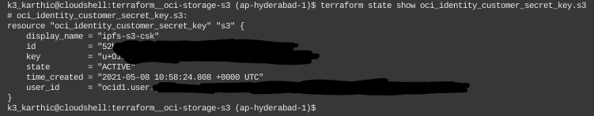

# Terraform — Create an Oracle Object Storage Bucket with S3

Create the following in Oracle Cloud,
* [Object Storage](https://www.oracle.com/cloud/storage/object-storage/) Bucket
* Amazon S3 Compatibility Access Key/ Secret Key pair.

The keypair generated is used by the Ansible script below,
* ansible__ipfs
  * GitHub: [github.com/k3karthic/ansible__ipfs](https://github.com/k3karthic/ansible__ipfs)
  * Codeberg: [codeberg.org/k3karthic/ansible__ipfs](https://codeberg.org/k3karthic/ansible__ipfs)

## Code Mirrors

* GitHub: [github.com/k3karthic/terraform__oci-storage-s3](https://github.com/k3karthic/terraform__oci-storage-s3/)
* Codeberg: [codeberg.org/k3karthic/terraform__oci-storage-s3](https://codeberg.org/k3karthic/terraform__oci-storage-s3)

## Configuration

**Step 1:** Create a file to store the [Terraform input variables](https://www.terraform.io/docs/language/values/variables.html). Use `india.tfvars.sample` as a reference. Keep `india.tfvars` as the filename or change the name in the following files,
1. `.gitignore`
1. `bin/plan.sh`

**Step 2:** Set `bucket_name` and `bucket_namespace` as desired.

**Step 2:** Set `compartment` to the desired value. List of compartments in your Oracle Cloud account are at [cloud.oracle.com/identity/compartments](https://cloud.oracle.com/identity/compartments).


## Authentication

[Oracle provider](https://registry.terraform.io/providers/hashicorp/oci/latest) documentation is at [registry.terraform.io/providers/hashicorp/oci/latest](https://registry.terraform.io/providers/hashicorp/oci/latest).

[Oracle Cloud Shell](https://www.oracle.com/devops/cloud-shell/) can deploy this script without configuration.

## Deployment

**Step 1:** Use the following command to create a [Terraform plan](https://www.terraform.io/docs/cli/run/index.html#planning),
```
$ ./bin/plan.sh
```

To avoid fetching the latest state of resources, use the following command,
```
$ ./bin/plan.sh -refresh=false
```

**Step 2:** Review the plan using the following command,
```
$ ./bin/view.sh
```

**Step 3:** [Apply](https://www.terraform.io/docs/cli/run/index.html#applying) the plan using the following command,
```
$ ./bin/apply.sh
```

**Step 4:** Get the Access Key ID and Secret Key using the following command,
```
$ terraform state show oci_identity_customer_secret_key.s3
```



## Encryption

Encrypt sensitive files (Terraform [input variables](https://www.terraform.io/docs/language/values/variables.html) and [state](https://www.terraform.io/docs/language/state/index.html)) before saving them. `.gitignore` must contain the unencrypted file paths.

Use the following command to decrypt the files after cloning the repository,
```
$ ./bin/decrypt.sh
```

Use the following command after running `bin/apply.sh` to encrypt the updated state files,
```
$ ./bin/encrypt.sh <gpg key id>
```
